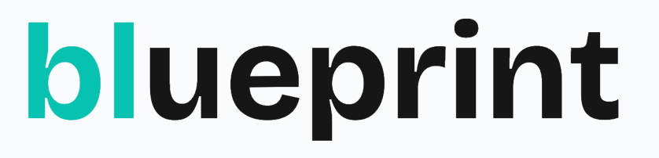
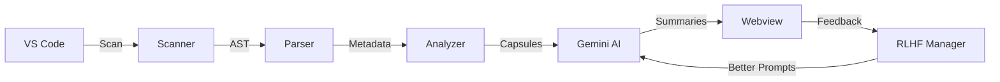

<p align="center">
  
  <h1 align="center">NexHacks</h1>
  <p align="center"><strong>AI-Powered Codebase Intelligence & Risk Analysis Platform</strong></p>
  <p align="center">
    <em>Instantly understand, visualize, and secure any codebase with the power of Gemini AI</em>
  </p>
  
</p>

<p align="center">
  
  
  
  
  
</p>

---

## 🎯 The Problem

Developers spend **~35% of their time** just trying to understand existing code. When joining a new project or reviewing unfamiliar code:

- 📚 Documentation is often outdated or missing
- 🔍 Understanding component relationships requires jumping between files
- ⚠️ Security vulnerabilities and code risks go unnoticed
- ⏰ Onboarding takes weeks instead of hours

## 💡 Our Solution

**NexHacks** is a VS Code extension that provides **instant AI-powered understanding** of any codebase through:

| Feature | Description |
|---------|-------------|
| **Interactive Visualization** | ReactFlow-powered canvas showing file relationships and dependencies |
| **AI Summaries** | Gemini-powered intelligent summaries at file, function, and directory levels |
| **Risk Analysis** | Automated security and code quality scanning with actionable recommendations |
| **Deep Analysis** | Block-level code structure analysis with real-time updates |
| **RLHF Feedback Loop** | Self-improving prompts based on user feedback |

---

## ✨ Key Features

### 🗺️ Interactive Codebase Visualization

- **Node-based graph** showing files and their dependencies
- **Click to explore** - open any file directly from the canvas
- **Real-time relationship mapping** with edge visualization
- **Zoom, pan, and navigate** large codebases effortlessly

### 🤖 Multi-Level AI Summaries

```
┌─────────────────────────────────────────────────────────────┐
│  📁 Project Overview (Architecture-level summary)           │
│    └── 📂 Directory Summaries (Module-level understanding)  │
│          └── 📄 File Summaries (Component-level details)    │
│                └── 🔧 Block Summaries (Function-level docs) │
└─────────────────────────────────────────────────────────────┘
```

- **Upper-level summaries**: Quick understanding from metadata
- **Deep analysis**: Line-by-line block summaries with structure mapping
- **Progressive loading**: See the graph instantly, summaries load in background

### 🛡️ Intelligent Risk Analysis

Automatically detects and categorizes:

| Risk Type | Examples |
|-----------|----------|
| 🔒 **Security** | SQL injection, XSS, hardcoded secrets, SSRF |
| ⚡ **Performance** | Memory leaks, N+1 queries, blocking I/O |
| ⚠️ **Error Handling** | Unhandled exceptions, missing validations |
| 🔄 **Concurrency** | Race conditions, deadlocks, shared state |
| 📝 **Type Safety** | Unsafe casts, potential null errors |
| 🔧 **API Misuse** | Deprecated patterns, missing cleanup |

Each function receives a risk level (🟢 Low → 🟡 Medium → 🟠 High → 🔴 Critical) with actionable recommendations.

### 🐻 Token Compression (TTC Integration)

- **Bear-1 model** from The Token Company reduces prompt sizes by up to **60%**
- Significantly reduces API costs while maintaining quality
- Automatic fallback if compression unavailable

### 🔄 Self-Improving RLHF Loop

- 👍/👎 feedback on any generated summary
- Prompts automatically rotate to better-performing versions
- Persistent feedback state across sessions

---

## 🏗️ Architecture

```
nexhacks/
├── src/                      # VS Code Extension
│   ├── extension.ts          # Extension entry (commands, webview)
│   └── core/                 # Core Analysis Engine
│       ├── gemini.ts         # Gemini AI client + TTC compression
│       ├── parser.ts         # Babel AST parser for JS/TS
│       ├── scanner.ts        # File system scanner
│       ├── analyzer.ts       # Dependency graph builder
│       ├── risk-agent.ts     # Security & quality analyzer
│       ├── feedback-manager.ts # RLHF feedback loop
│       └── prompts.ts        # Versioned prompt templates
├── webview-ui/               # React + ReactFlow Canvas
│   └── src/
│       ├── App.tsx           # Main visualization component
│       └── components/       # UI components (Radix UI)
├── cli/                      # CLI interface (bonus!)
└── samples/                  # Sample projects for testing
```

### Data Flow



---

## 🚀 Quick Start

### Installation

```bash
# Clone the repository
git clone https://github.com/your-team/nexhacks.git
cd nexhacks

# Install dependencies
pnpm install

# Build the webview UI
pnpm run build:webview

# Compile the extension
pnpm run compile
```

### Configuration

1. Open VS Code Settings
2. Search for "Nexhacks"
3. Add your API keys:
   - **Gemini API Key** - Get yours at [Google AI Studio](https://aistudio.google.com/app/apikey)
   - **TTC API Key** (optional) - For token compression

### Usage

1. Open any codebase in VS Code
2. Open Command Palette (`Cmd+Shift+P` / `Ctrl+Shift+P`)
3. Run: `Open Visualizer`
4. Explore your codebase visually!

---

## 🛠️ Technology Stack

| Layer | Technologies |
|-------|-------------|
| **Extension** | VS Code Extension API, TypeScript |
| **AI** | Google Gemini 3 Flash, TTC Bear-1 |
| **Parser** | Babel (AST parsing for JS/TS/JSX/TSX) |
| **Visualization** | React, ReactFlow, D3-force |
| **UI Components** | Radix UI, Tailwind CSS |
| **Build** | Vite, pnpm workspaces |

---


## 📈 What Makes This Hackathon-Worthy

1. **Real Problem, Real Solution** - Addresses the #1 developer productivity pain point
2. **Production-Ready Architecture** - Clean separation, extensible design, proper error handling
3. **Cutting-Edge AI Integration** - Gemini 3 Flash + TTC compression for optimal performance
4. **Self-Improving System** - RLHF-inspired feedback loop for continuous improvement
5. **Beautiful UX** - Interactive canvas with real-time updates
6. **Multi-Level Analysis** - From architecture overview down to individual functions
7. **Security-First** - Built-in risk analysis catches vulnerabilities before production

---


## 👥 Team

Built with ❤️ for NexHacks 2026

---

## 📄 License

MIT License - see [LICENSE](LICENSE) for details
