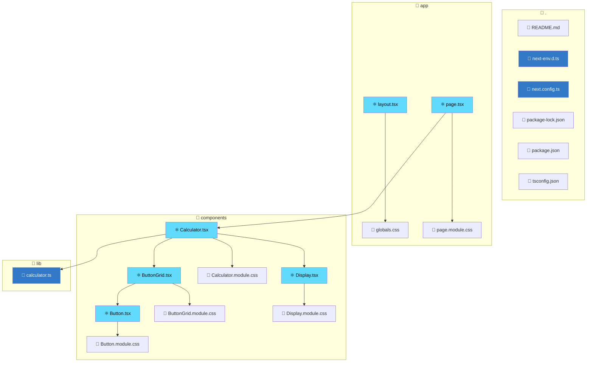

# Codebase Documentation

*Auto-generated wiki documentation*

## Overview

| Metric | Value |
|--------|-------|
| Total Files | 19 |
| Directories | 4 |
| Internal Connections | 12 |
| External Dependencies | 3 |

### Entry Points

- `README.md`
- `app/layout.tsx`
- `app/page.tsx`
- `next-env.d.ts`
- `next.config.ts`

## Architecture Diagram

## External Dependencies

- `next`
- `next/font/google`
- `react`

## Files

### 📁 .

#### 📄 README.md

**Type:** Module
**Exports:** None
**Dependencies:** None
**Used By:** None

---

#### 📄 next-env.d.ts

**Type:** Module
**Exports:** None
**Dependencies:** routes.d.ts
**Used By:** None

---

#### 📄 next.config.ts

**Type:** Module
**Exports:** nextConfig
**Dependencies:** None
**Used By:** None

---

#### 📄 package-lock.json

**Type:** Configuration
**Exports:** None
**Dependencies:** None
**Used By:** None

---

#### 📄 package.json

**Type:** Configuration
**Exports:** None
**Dependencies:** None
**Used By:** None

---

#### 📄 tsconfig.json

**Type:** Configuration
**Exports:** None
**Dependencies:** None
**Used By:** None

---

### 📁 app

#### 📄 globals.css

**Type:** Stylesheet
**Exports:** None
**Dependencies:** None
**Used By:** layout.tsx

---

#### ⚛️ layout.tsx

**Type:** React Component
**Exports:** metadata, RootLayout
**Dependencies:** globals.css
**Used By:** None
**Functions:** RootLayout

---

#### 📄 page.module.css

**Type:** Stylesheet
**Exports:** None
**Dependencies:** None
**Used By:** page.tsx

---

#### ⚛️ page.tsx

**Type:** React Component
**Exports:** Home
**Dependencies:** Calculator.tsx, page.module.css
**Used By:** None
**Functions:** Home

---

### 📁 components

#### 📄 Button.module.css

**Type:** Stylesheet
**Exports:** None
**Dependencies:** None
**Used By:** Button.tsx

---

#### ⚛️ Button.tsx

**Type:** React Component
**Exports:** Button
**Dependencies:** Button.module.css
**Used By:** ButtonGrid.tsx
**Functions:** Button

---

#### 📄 ButtonGrid.module.css

**Type:** Stylesheet
**Exports:** None
**Dependencies:** None
**Used By:** ButtonGrid.tsx

---

#### ⚛️ ButtonGrid.tsx

**Type:** React Component
**Exports:** ButtonGrid
**Dependencies:** Button.tsx, ButtonGrid.module.css
**Used By:** Calculator.tsx
**Functions:** ButtonGrid

---

#### 📄 Calculator.module.css

**Type:** Stylesheet
**Exports:** None
**Dependencies:** None
**Used By:** Calculator.tsx

---

#### ⚛️ Calculator.tsx

**Type:** React Component
**Exports:** Calculator
**Dependencies:** calculator.ts, Display.tsx, ButtonGrid.tsx, Calculator.module.css
**Used By:** page.tsx
**Functions:** Calculator

---

#### 📄 Display.module.css

**Type:** Stylesheet
**Exports:** None
**Dependencies:** None
**Used By:** Display.tsx

---

#### ⚛️ Display.tsx

**Type:** React Component
**Exports:** Display
**Dependencies:** Display.module.css
**Used By:** Calculator.tsx
**Functions:** Display

---

### 📁 lib

#### 📄 calculator.ts

**Type:** Module
**Exports:** add, subtract, multiply, divide, Operation, calculate, parseInput, formatDisplay
**Dependencies:** None
**Used By:** Calculator.tsx
**Functions:** add, subtract, multiply, divide, calculate, parseInput, formatDisplay

---
